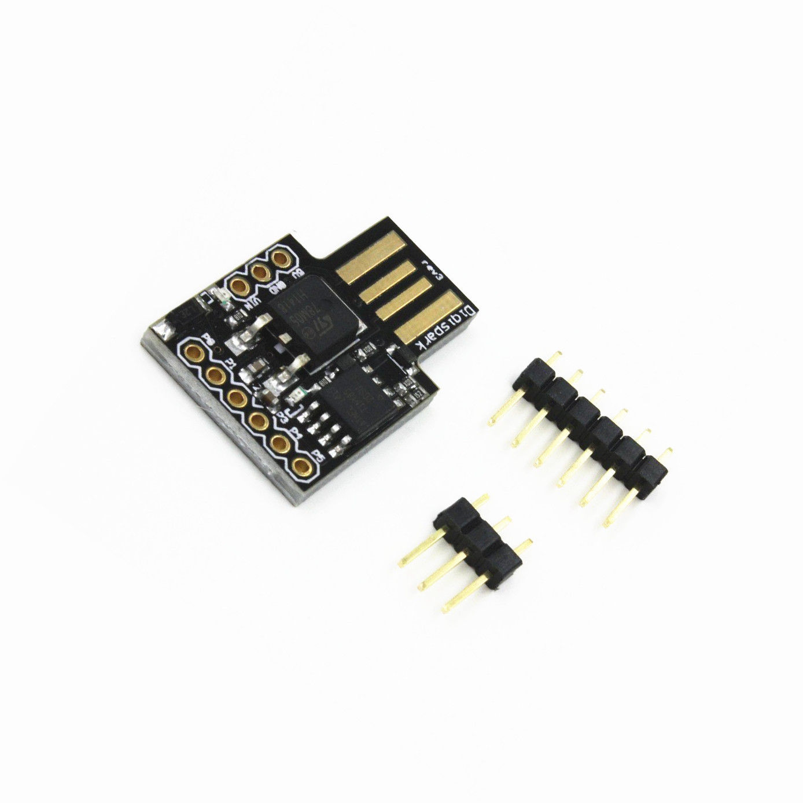

[Watch video here](https://www.youtube.com/watch?v=0a4QIw2vKpM)

# Parts List:

#### Digispark microprocessor

[eBay](http://www.ebay.co.uk/itm/Digispark-Kickstarter-Micro-General-USB-Development-Board-For-Arduino-ATTINY85-/191738431076?hash=item2ca4804664) 		£1.05

#### GY-521 (MPU-6050) accelerometer

[eBay](http://www.ebay.co.uk/itm/MPU-6050-6-DOF-3-Axis-Accelerometer-Gyroscope-Sensor-Module-GY-521-for-Arduino-/292083687743?hash=item44018b613f:g:fFcAAOSwmgJY7dsS) 		  £1.04

#### USB charger 1800mAh

[B&M Stores](http://www.bmstores.co.uk/products/intempo-1800mah-plug-and-charge-power-source-304876)			 £3.99

#### Waterproof Neopixel Strip 30LEDs/m

(1m should be enough for the circumference of a caixa, hep or timba - you may need more for surdos or more elaborate patterns)

[Happychrisji](http://www.ebay.co.uk/itm/181724643383) (China)		£20.86 per 5m silicone tube

[Chinly2012](http://www.ebay.co.uk/itm/5meters-DC5V-30LED-M-WS2812b-led-strip-30IC-M-SMD5050-led-IP67-waterproof-/251985318806?_trksid=p2141725.m3641.l6368) (China)		£17.24 per 5m silicone tube

[Happychrisji](http://www.banggood.com/5M-45W-150SMD-WS2812B-LED-RGB-Colorful-Strip-Light-Waterproof-IP65-WhiteBlack-PCB-DC5V-p-1035640.html) (China)		£18.04 per 5m silicone-coated

# Circuit Diagram:

# Code
## Dependencies:
* [Arduino IDE](https://www.arduino.cc/en/Main/Software)

[Download the code here](https://raw.githubusercontent.com/axwax/arco_chocalho_lights_digispark/master/arco_chocalho_lights_digispark.ino)